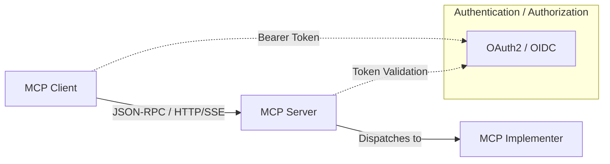

# MCP (Model Context Protocol) for Go

MCP is a Go implementation of the Model Context Protocol — a standardized way for applications to communicate with AI models. It allows developers to seamlessly bridge applications and AI models using a lightweight, JSON-RPC–based protocol.

This repository contains the shared protocol definitions and schemas for MCP. It is used by [MCP](github.com/viant/mcp), which provides the actual implementation of the MCP server and client framework.

[Official Model Context Protocol Specification](https://modelcontextprotocol.io/introduction)


## Overview

MCP (Model Context Protocol) is designed to provide a standardized communication layer between applications and AI models. The protocol simplifies the integration of AI capabilities into applications by offering a consistent interface for resource access, prompt management, model interaction, and tool invocation.

Key features:
- JSON-RPC 2.0–based communication
- Support for multiple transport protocols (HTTP/SSE, stdio)
- Server-side features:
  - Resource management
  - Model prompting and completion
  - Tool invocation
  - Subscriptions for resource updates
  - Logging
  - Progress reporting
  - Request cancellation
- Client-side features:
  - Roots
  - Sampling


## Architecture

For detailed guides on custom implementers and authentication, see [docs/implementer.md](docs/implementer.md) and [docs/authentication.md](docs/authentication.md).

MCP is built around the following components:

2. **Server**: Handles incoming requests and dispatches to implementer
3. **Client**: Makes requests to MCP-compatible servers
4. **Implementer**: Provides the actual functionality behind each protocol method

### High-Level Architecture



## Getting Started

### Installation

```bash
go get github.com/viant/mcp
```

### Creating a Server

#### Quick Start: Default Implementer

[Default implementer](github.com/viant/mcp-protocol/server/default) can be used to quickly set up an MCP server.
This implementer provides no-op stubs for all methods, allowing you to focus on implementing only the methods you need.
Register handlers inline without writing a custom implementer type:

```go
package main

import (
  "context"
  "fmt"
  "github.com/viant/jsonrpc"
  "github.com/viant/mcp-protocol/schema"
  serverproto "github.com/viant/mcp-protocol/server"
  "github.com/viant/mcp/server"
  "log"
)

func main() {


  type Addition struct {
    A int `json:"a"`
    B int `json:"b"`
  }
  
  newImplementer := serverproto.WithDefaultImplementer(context.Background(), func(implementer *serverproto.DefaultImplementer) error {
    // Register a simple resource
    implementer.RegisterResource(schema.Resource{Name: "hello", Uri: "/hello"},
      func(ctx context.Context, request *schema.ReadResourceRequest) (*schema.ReadResourceResult, *jsonrpc.Error) {
        return &schema.ReadResourceResult{Contents: []schema.ReadResourceResultContentsElem{{Text: "Hello, world!"}}}, nil
      })

    // Register a simple calculator tool: adds two integers
    if err := serverproto.RegisterTool[*Addition](implementer, "add", "Add two integers", func(ctx context.Context, input *Addition) (*schema.CallToolResult, *jsonrpc.Error) {
      sum := input.A + input.B
      return &schema.CallToolResult{Content: []schema.CallToolResultContentElem{{Text: fmt.Sprintf("%d", sum)}}}, nil
    }); err != nil {
      return err
    }
	return nil
  })

  srv, err := server.New(
    server.WithNewImplementer(newImplementer),
    server.WithImplementation(schema.Implementation{"default", "1.0"}),
  )
  if err != nil {
    log.Fatalf("Failed to create server: %v", err)
  }

  log.Fatal(srv.HTTP(context.Background(), ":4981").ListenAndServe())
}
```


### Further Reading

- **Implementer Guide**: [docs/implementer.md](docs/implementer.md)
- **Authentication Guide**: [docs/authentication.md](docs/authentication.md)
 
## Authentication & Authorization Summary

MCP supports transport-agnostic authentication and authorization (HTTP or HTTP-SSE) via OAuth2/OIDC in two modes:

- **Global Resource Protection (spec-based)**:
  - `github.com/viant/mcp/server/auth.AuthServer` enforces a Bearer token across all endpoints, except those excluded via `ExcludeURI` (e.g. `/sse`).
  - Configure by creating an `auth.Service` from `authorization.Policy` and wiring it with:
    `server.WithProtectedResourcesHandler(service.ProtectedResourcesHandler)`,
    `server.WithAuthorizer(service.Middleware)`, and
    `server.WithJRPCAuthorizer(service.EnsureAuthorized)`.
  - Exposes `/.well-known/oauth-protected-resource` for metadata discovery (RFC 9728).

- **Fine-Grained Tool/Resource Control (experimental)**:
  - Implements `auth.Authorizer` in `AuthServer.EnsureAuthorized`, returning `401 Unauthorized` per JSON-RPC request.
  - Configure per-tool/resource metadata via `Config.Tools` or `Config.Tenants` in `authorization.Policy`.

- **Fallback Token Fetching**:
  - `github.com/viant/mcp/server/auth.FallbackAuth` wraps a strict `AuthServer`.
  - On `401` challenge, fetches tokens via `ProtectedResourceTokenSource` and optional ID tokens via `IdTokenSource`, then retries.
  - Create with `auth.NewFallbackAuth(strictAuthServer, tokenSource, idTokenSource)`.

- **Client-Side Support**:
  - Use `github.com/viant/mcp/client/auth/transport.New` with:
    - `WithStore(store.Store)`: handles client config, metadata & token caching.
    - `WithAuthFlow(flow.AuthFlow)`: selects interactive auth flow (e.g., browser PKCE).
  - The RoundTripper automatically:
    1. Handles the initial `401` challenge (WWW-Authenticate header).
    2. Discovers protected resource and auth server metadata.
    3. Acquires tokens and retries the original request with `Authorization: Bearer <token>`.
 - Example SSE integration:
    ```go
    rt, _ := transport.New(
        transport.WithStore(myStore),
        transport.WithAuthFlow(flow.NewBrowserFlow()),
    )
    httpClient := &http.Client{Transport: rt}
    sseTransport, _ := sse.New(ctx, "https://myapp.example.com/sse", sse.WithClient(httpClient))
    mcpClient := client.New("MyClient", "1.0", sseTransport, client.WithCapabilities(schema.ClientCapabilities{}))
    ```

These features are transport-agnostic and apply equally over HTTP, SSE, or other supported transports.

## Protocol Methods

MCP supports the following Server Side methods:

- `initialize` - Initialize the connection
- `ping` - Check server status
- `resources/list` - List available resources
- `resources/read` - Read resource contents
- `resources/templates/list` - List resource templates
- `resources/subscribe` - Subscribe to resource updates
- `resources/unsubscribe` - Unsubscribe from resource updates
- `prompts/list` - List available prompts
- `prompts/get` - Get prompt details
- `tools/list` - List available tools
- `tools/call` - Call a specific tool
- `complete` - Get completions from the model
- `logging/setLevel` - Set logging level

MCP supports the following Client Side methods:

- `roots/list` - List available roots
- `sampling/createMessage` - A standardized way for servers to request LLM sampling (“completions” or “generations”) from language models via clients.


can 
## Contributing

Contributions are welcome! Please feel free to submit a Pull Request.

## License

This project is licensed under the [Apache License 2.0](LICENSE).

## Credits

Author: Adrian Witas

This project is maintained by [Viant](https://github.com/viant).
