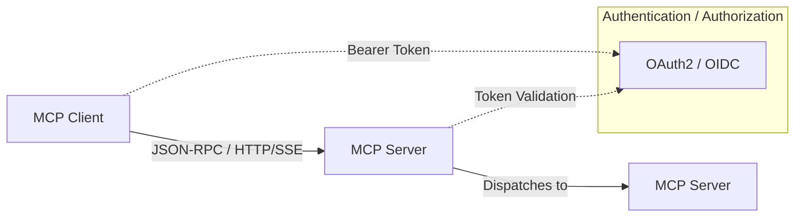

# MCP (Model Context Protocol) for Go

MCP is a Go implementation of the Model Context Protocol — a standardized way for applications to communicate with AI models. It allows developers to seamlessly bridge applications and AI models using a lightweight, JSON-RPC–based protocol.

This repository contains the shared protocol definitions and schemas for MCP. It is used by [MCP](github.com/viant/mcp), which provides the actual implementation of the MCP server and client framework.

[Official Model Context Protocol Specification](https://modelcontextprotocol.io/introduction)


## Overview

MCP (Model Context Protocol) is designed to provide a standardized communication layer between applications and AI models. The protocol simplifies the integration of AI capabilities into applications by offering a consistent interface for resource access, prompt management, model interaction, and tool invocation.

Key features:
- JSON-RPC 2.0–based communication
- Support for multiple transport protocols (HTTP/SSE, stdio)
- Server-side features:
  - Resource management
  - Model prompting and completion
  - Tool invocation
  - Subscriptions for resource updates
  - Logging
  - Progress reporting
  - Request cancellation
- Client-side features:
  - Roots
  - Sampling


## Architecture

For detailed guides on custom server implementations and authentication, see [docs/implementer.md](docs/implementer.md) and [docs/authentication.md](docs/authentication.md).

MCP is built around the following components:

2. **Server**: Handles incoming requests and dispatches to the protocol implementation
3. **Client**: Makes requests to MCP-compatible servers
4. **Protocol Implementation (server.Handler)**: Provides the actual functionality behind each protocol method

### High-Level Architecture



## Getting Started

### Installation

```bash
go get github.com/viant/mcp

If you just need to connect **existing tools** to a remote MCP server you might prefer to use the standalone **Bridge** binary instead of embedding the Go package.  See [Bridge Guide](docs/bridge.md) for details.
```

### Creating a Server

#### Quick Start: Default Server

[DefaultHandler](github.com/viant/mcp-protocol/server/handler.go) can be used to quickly set up an MCP server.
It provides no-op stubs for all methods, allowing you to focus on implementing only the methods you need.
Register handlers inline without writing a custom server type:

```go
package main

import (
  "context"
  "encoding/json"
  "fmt"
  "github.com/viant/jsonrpc"
  "github.com/viant/mcp-protocol/schema"
  serverproto "github.com/viant/mcp-protocol/server"
  "github.com/viant/mcp/server"
  "log"
)

func main() {

  type Addition struct {
    A int `json:"a"`
    B int `json:"b"`
  }

  type Output struct {
    Result int
  }

  newHandler := serverproto.WithDefaultHandler(context.Background(), func(server *serverproto.DefaultHandler) error {
    // Register a simple resource
    server.RegisterResource(schema.Resource{Name: "hello", Uri: "/hello"},
      func(ctx context.Context, request *schema.ReadResourceRequest) (*schema.ReadResourceResult, *jsonrpc.Error) {
        return &schema.ReadResourceResult{Contents: []schema.ReadResourceResultContentsElem{{Text: "Hello, world!"}}}, nil
      })

    type Addition struct {
      A int `json:"a"`
      B int `json:"b"`
    }

    type Result struct {
      Result int `json:"acc"`
    }
    // Register a simple calculator tool: adds two integers
    if err := serverproto.RegisterTool[*Addition, *Result](server.Registry, "add", "Add two integers", func(ctx context.Context, input *Addition) (*schema.CallToolResult, *jsonrpc.Error) {
      sum := input.A + input.B
      out := &Result{Result: sum}
      data, err := json.Marshal(out)
      if err != nil {
        return nil, jsonrpc.NewInternalError(fmt.Sprintf("failed to marshal result: %v", err), nil)
      }
      return &schema.CallToolResult{Content: []schema.CallToolResultContentElem{{Text: string(data)}}}, nil
    }); err != nil {
      return err
    }
    return nil
  })

  srv, err := server.New(
    server.WithNewHandler(newHandler),
    server.WithImplementation(schema.Implementation{"default", "1.0"}),
  )
  if err != nil {
    log.Fatalf("Failed to create server: %v", err)
  }

  // Choose one transport (see below). Example: HTTP (SSE by default)
  log.Fatal(srv.HTTP(context.Background(), ":4981").ListenAndServe())

}
```


### Starting the Server

- Stdio (typical for editor integrations):

  ```go
  stdioSrv := srv.Stdio(context.Background())
  log.Fatal(stdioSrv.ListenAndServe())
  ```

- HTTP over SSE (default):

  ```go
  httpSrv := srv.HTTP(context.Background(), ":4981")
  log.Fatal(httpSrv.ListenAndServe())
  ```

- HTTP Streamable (toggle):

  ```go
  srv.UseStreamableHTTP(true)
  httpSrv := srv.HTTP(context.Background(), ":4981")
  log.Fatal(httpSrv.ListenAndServe())
  ```

If you prefer a single configuration object, see `NewServer` in `server.go` which accepts transport options and can enable Streamable HTTP based on `Transport.Type`.

#### Endpoints and Routing

- By default, both transports are mounted:
  - SSE: `GET /sse` and `POST /message`
  - Streamable HTTP: `POST/GET /mcp`
- You can enable root redirect so `"/"` forwards to the active transport base:
  - `WithRootRedirect(true)`
- You can also customize the endpoint paths:
  - `WithStreamableURI("/api/mcp")`
  - `WithSSEURI("/api/sse")`
  - `WithSSEMessageURI("/api/rpc")`

Example:

```go
srv, _ := mcp.New(
  mcp.WithNewHandler(newHandler),
  mcp.WithStreamableURI("/api/mcp"),
  mcp.WithSSEURI("/api/sse"),
  mcp.WithSSEMessageURI("/api/rpc"),
  mcp.WithRootRedirect(true), // redirects "/" to /api/mcp if UseStreamableHTTP(true), else /api/sse
)
srv.UseStreamableHTTP(true)
httpSrv := srv.HTTP(context.Background(), ":4981")
log.Fatal(httpSrv.ListenAndServe())
```

### Add a Resource

Register a readable resource URI and return its content from your handler.

```go
h.RegisterResource(schema.Resource{Name: "hello", Uri: "/hello"},
  func(ctx context.Context, req *schema.ReadResourceRequest) (*schema.ReadResourceResult, *jsonrpc.Error) {
    return &schema.ReadResourceResult{Contents: []schema.ReadResourceResultContentsElem{{Text: "Hello, world!", Uri: req.Params.Uri}}}, nil
  })
```

To notify clients about updates, emit `resources/updated` via `h.Notifier`.

### Add a Prompt

Expose reusable prompt templates that clients can list and resolve.

```go
prompt := &schema.Prompt{Name: "welcome", Arguments: []schema.PromptArgument{{Name: "name", Required: ptr(true)}}}
h.RegisterPrompts(prompt, func(ctx context.Context, p *schema.GetPromptRequestParams) (*schema.GetPromptResult, *jsonrpc.Error) {
  return &schema.GetPromptResult{Messages: []schema.PromptMessage{{Role: schema.RoleAssistant, Content: schema.TextContent{Type: "text", Text: "Hello, " + p.Arguments["name"] + "!"}}}}, nil
})
```

See the Server Guide for deeper coverage of resources and prompts.

### Further Reading

- **Server Implementation Guide**: [docs/implementer.md](docs/implementer.md)
- **Server Guide (Tools, Resources, Prompts)**: [docs/server_guide.md](docs/server_guide.md)
- **Authentication Guide**: [docs/authentication.md](docs/authentication.md)
- **Bridge (local proxy) Guide**: [docs/bridge.md](docs/bridge.md)
 - **Client Guide**: [docs/client.md](docs/client.md)
 
### Creating a Client

You can connect to an MCP server over stdio, HTTP/SSE, or HTTP streamable.

- SSE client (simple):

  ```go
  ctx := context.Background()
  sseTransport, _ := sse.New(ctx, "http://localhost:4981/sse")
  cli := client.New("Demo", "1.0", sseTransport)
  if _, err := cli.Initialize(ctx); err != nil { log.Fatal(err) }
  tools, _ := cli.ListTools(ctx, nil)
  fmt.Println("tools:", len(tools.Tools))
  ```

- Streamable client:

  ```go
  ctx := context.Background()
  streamTransport, _ := streamable.New(ctx, "http://localhost:4981/")
  cli := client.New("Demo", "1.0", streamTransport)
  _, _ = cli.Initialize(ctx)
  ```

- Stdio client (spawn a child process):

  ```go
  stdioTransport, _ := stdio.New("./your-mcp-server-binary",
    stdio.WithArguments("--flag1", "value"))
  cli := client.New("Demo", "1.0", stdioTransport)
  _, _ = cli.Initialize(context.Background())
  ```

- OAuth2/OIDC (optional):

  See the Authentication section below for creating an `http.Client` with token handling and passing it to the SSE/streamable transports.

Advanced: If you need automatic reconnect and integrated auth, use the helper `mcp.NewClient(handler, *ClientOptions)` from the root package, which builds the transport and wires an auth interceptor. Supply a `pclient.Handler` implementation if your client needs to support server-initiated calls (roots, sampling, elicitation).

## Authentication & Authorization Summary

MCP supports transport-agnostic authentication and authorization (HTTP or HTTP-SSE) via OAuth2/OIDC in two modes:

- **Global Resource Protection (spec-based)**:
  - `github.com/viant/mcp/server/auth.AuthServer` enforces a Bearer token across all endpoints, except those excluded via `ExcludeURI` (e.g. `/sse`).
  - Configure by creating an `auth.Service` from `authorization.Policy` and wiring it with:
    `server.WithProtectedResourcesHandler(service.ProtectedResourcesHandler)`,
    `server.WithAuthorizer(service.Middleware)`, and
    `server.WithJRPCAuthorizer(service.EnsureAuthorized)`.
  - Exposes `/.well-known/oauth-protected-resource` for metadata discovery (RFC 9728).

- **Fine-Grained Tool/Resource Control (experimental)**:
  - Implements `auth.Authorizer` in `AuthServer.EnsureAuthorized`, returning `401 Unauthorized` per JSON-RPC request.
  - Configure per-tool/resource metadata via `Config.Tools` or `Config.Tenants` in `authorization.Policy`.

- **Fallback Token Fetching**:
  - `github.com/viant/mcp/server/auth.FallbackAuth` wraps a strict `AuthServer`.
  - On `401` challenge, fetches tokens via `ProtectedResourceTokenSource` and optional ID tokens via `IdTokenSource`, then retries.
  - Create with `auth.NewFallbackAuth(strictAuthServer, tokenSource, idTokenSource)`.

- **Client-Side Support**:
  - Use `github.com/viant/mcp/client/auth/transport.New` with:
    - `WithStore(store.Store)`: handles client config, metadata & token caching.
    - `WithAuthFlow(flow.AuthFlow)`: selects interactive auth flow (e.g., browser PKCE).
  - The RoundTripper automatically:
    1. Handles the initial `401` challenge (WWW-Authenticate header).
    2. Discovers protected resource and auth server metadata.
    3. Acquires tokens and retries the original request with `Authorization: Bearer <token>`.
 - Example SSE integration:
    ```go
    rt, _ := transport.New(
        transport.WithStore(myStore),
        transport.WithAuthFlow(flow.NewBrowserFlow()),
    )
    httpClient := &http.Client{Transport: rt}
    sseTransport, _ := sse.New(ctx, "https://myapp.example.com/sse", sse.WithClient(httpClient))
    mcpClient := client.New("MyClient", "1.0", sseTransport, client.WithCapabilities(schema.ClientCapabilities{}))
    ```

These features are transport-agnostic and apply equally over HTTP, SSE, or other supported transports.

## Protocol Methods

MCP supports the following Server Side methods:

- `initialize` - Initialize the connection
- `ping` - Check server status
- `resources/list` - List available resources
- `resources/read` - Read resource contents
- `resources/templates/list` - List resource templates
- `resources/subscribe` - Subscribe to resource updates
- `resources/unsubscribe` - Unsubscribe from resource updates
- `prompts/list` - List available prompts
- `prompts/get` - Get prompt details
- `tools/list` - List available tools
- `tools/call` - Call a specific tool
- `complete` - Get completions from the model
- `logging/setLevel` - Set logging level

MCP supports the following Client Side methods:

- `roots/list` - List available roots
- `sampling/createMessage` - A standardized way for servers to request LLM sampling (“completions” or “generations”) from language models via clients.
- `elicitation/create` - Ask the client to perform an elicitation (model completion) using provided prompts.
- `interaction/create` - Initiate a user-interaction request, allowing the server to prompt the user via the client UI.

 
## Contributing

Contributions are welcome! Please feel free to submit a Pull Request.

## License

This project is licensed under the [Apache License 2.0](LICENSE).

## Credits

Author: Adrian Witas

This project is maintained by [Viant](https://github.com/viant).
