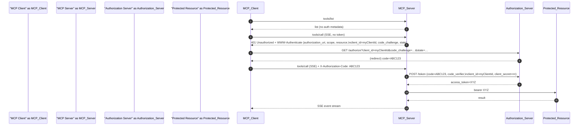
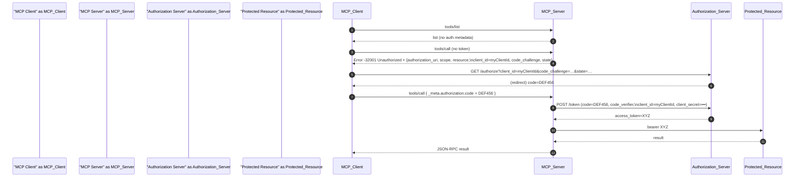

# Fine-Grained Resource Control for Multi-User Authorization

## Motivation

Many MCP clients require per-user credentials to call downstream APIs, and the lack of a standard leads to inconsistent
client behavior and security gaps. This proposal standardizes OAuth-based authorization in MCP.

## Background

Multiple ideas have been discussed in the MCP community about how to handle **authorization** for tools and resources in
multi-user scenarios:

- **Per-Tenant Configuration** via _meta: One proposal (
  Discussion [#193](https://github.com/modelcontextprotocol/modelcontextprotocol/discussions/193) suggested allowing a
  single MCP server instance to serve many end-users by passing a clientId and user-specific clientConfig in each
  request
    - This would reconfigure the server per call (e.g. providing a different API token or target resource for each user)
      instead of requiring separate server instances.
    - This approach treats user credentials or context as part of the call metadata, enabling multi-tenant clients to
      dynamically inject config for each end-user.

- **MCP Server as OAuth 2.0 Resource Server**: Issue [#205](https://github.com/modelcontextprotocol/modelcontextprotocol/discussions/205) proposed that MCP servers should act as OAuth 2.0 resource servers, using external identity providers for authorization.
    - In this model, the MCP server itself doesn’t issue tokens or maintain session state; the client obtains an access
      token from an OAuth authorization server (via any standard flow) and presents it with requests
    - The MCP server can then rely on standard OAuth mechanisms – for example, returning an HTTP 401 with a
      WWW-Authenticate challenge or providing discovery info – to prompt the client to get proper tokens
    - This design leverages existing enterprise auth infrastructure (increasing adoptability) and keeps MCP servers
      stateless
    - It could also enable the server to perform an OAuth 2.0 Token Exchange (RFC 8693) on the client’s token to act on
      behalf of the user
    - This would allow the MCP server to act as a proxy for the client, using its own token to call downstream APIs on
      behalf of the user, obtaining a delegated token for downstream APIs.
- **On-Behalf-Of (OBO) Token Exchange**: Related to the above, discussion
  #214(https://github.com/modelcontextprotocol/modelcontextprotocol/discussions/214) raised support for OAuth 2.0 Token
  Exchange (RFC 8693) to avoid passing raw user tokens around. The idea is to enable delegation: an agent client might
  present one token to an MCP server, which exchanges it for a new token restricted to the server’s context (preventing
  misuse of the original token). This was motivated by security concerns that simply forwarding user tokens is risky
    - For example, the Cloudflare team illustrated a model where the MCP server issues its own token to the client
      instead of exposing the user’s Google API token, thereby limiting an attacker’s capabilities if the client token
      is compromised
    - This addresses the OWASP-described risk of “Excessive Agency”, by ensuring a stolen token can only invoke the MCP
      server’s constrained tools, not the upstream service broadly
- **Per-Tool OAuth Scopes (Multi-User Auth)**: In discussion
  #234(https://github.com/modelcontextprotocol/modelcontextprotocol/discussions/234), wdawson proposed adding an
  authorization spec to each tool definition to declare what kind of token and scopes it requires
    - The MCP client (e.g. an AI agent) would then acquire an appropriate end-user token (say via OAuth2) and supply it
      at call time in the request metadata
    - This lets one agent serve many users, each providing their own credentials for external services, without the MCP
      server persisting those credentials. The proposal introduced a JSON-RPC error code for authorization failures
      (`-32001` for missing or invalid tokens), analogous to HTTP 401 Unauthorized.
    - The emphasis was on keeping the server stateless and focused on proxying the tool action, while pushing token
      management to the client
    - This approach was seen as meeting the industry “where it is” with OAuth, rather than requiring new auth frameworks

- **Client vs. Server Responsibility Debate**: There is ongoing discussion about the trade-offs of the client-managed
  token approach.
    - Many agree that the MCP server should stay focused on exposing tools and resources without storing user tokens. At
      the same time, concerns were raised about security and complexity for client developers. For instance, if each
      tool integration requires the client to implement a different OAuth flow, it burdens agent developers and could
      discourage use of certain tools
    - It was suggested that MCP needs a mechanism for the server to guide the client through authorization when needed
      for example, by providing an authorization URL or instructions if a token is missing. Others pointed out that
      standard OAuth consent flows already allow users to grant a subset of scopes, and the server could simply enforce
      scope requirements (skipping or failing a tool call if not authorized) without additional protocol changes
    - There was even a proposal that the server could handle the OAuth exchange and then hand the obtained token back to
      the client for storage , combining a smoother user onboarding with client-side token storage thereafter.

  In summary, the community has explored per-tool and per-resource auth scopes, multi-tenant call metadata, client vs
  server auth roles, token exchange, and error handling for auth. Building on those ideas, this proposal aims to
  consolidate a path forward for fine-grained resource control in MCP, aligning with established terminology and
  extending the protocol where needed.

# OAuth 2.0 / PKCE Mediation for MCP
*(Revised with naming, typos, and flow fixes)*

---

## Proposal Summary

### Per-Tool / Resource Auth Metadata
Each tool or resource **declares** what it needs; the MCP server enforces it:

| Field | Type | Purpose |
|-------|------|---------|
| `protectedResourceMetadata` | object | [RFC 9728] JSON fragment describing the resource (URI + `authorization_servers`). |
| `required_scopes` | string[] | Minimal OAuth scopes (empty = bearer token only). |
| `use_id_token` | boolean | `true` → request an ID token *instead of / in addition to* an access-token. |
| `client_id` | string | Confidential OAuth 2 client identifier registered with the AS. |


---

### Two Mediation Modes

1. **HTTP SSE**
    * If an SSE request arrives **without credentials**, the MCP server responds:
      ```
      HTTP/1.1 401 Unauthorized  
      WWW-Authenticate: Bearer authorization_uri="…/.well-known/oauth-protected-resource", \
                        scope="…", resource="…", client_id="…", \
                        code_challenge="…", code_challenge_method="S256", state="…"
      ```  
      *`client_id`, `code_challenge`, … are non-standard auth-params; clients **MUST ignore unknown parameters** per RFC 6750 §3.*
    * Client launches a front-channel **Authorization-Code + PKCE** flow and then retries the SSE request with header:
      ```
      X-Authorization-Code: <code>
      ```

2. **JSON-RPC**
    * If `tools/call` is invoked without credentials, the server replies:
      ```json
      {
        "jsonrpc": "2.0",
        "id": 42,
        "error": {
          "code": -32001,
          "message": "Unauthorized",
          "data": {
            "required_scopes": ["scope1"],
            "protectedResourceMetadata": {
              "resource": "myTool",
              "authorization_servers": ["https://auth.acme-cloud.com"]
            },
            "client_id": "myClientId",
            "code_challenge": "Xz…",
            "code_challenge_method": "S256",
            "state": "abc123"
          }
        }
      }
      ```  
    * The client performs the same OAuth flow, then re-calls with:
      ```jsonc
      "_meta": { "authorization": { "code": "<auth-code>" } }
      ```

3. **Single Error Code**
    * **`-32001`** is reserved for *all* authorization failures (analogous to HTTP 401).  
      *Until the JSON-RPC error-code registry is final (draft-ietf-json-rpc-cb58), any value in -32000…-32099 remains implementation-defined.*

---

### Token Redemption & Caching (Server Side)

* MCP server redeems the code (PKCE verifier + `client_id`) at the AS.
* Access-tokens are cached per **(resource, scope, client)** triple.
* A cached token may be reused **only if** its scope ⊇ client,  `required_scopes` *and* it is valid for the exact `resource` URI.
* Refresh or silent-refresh when possible; never expose tokens outside the server boundary.

---

## Proposal Details

### Policy Schema Example

```jsonc
{
  "global": {
    "protectedResourceMetadata": {
      "resource": "MCPServer",
      "authorization_servers": [
        "https://auth.acme-cloud.com"
      ]
    },
    "required_scopes": ["scope1"],
    "use_id_token": false,
    "client_id": "myClientId1"
  },
  "tools": [
    {
      "protectedResourceMetadata": {
        "resource": "myTool",
        "authorization_servers": []
      },
      "required_scopes": ["scope1"],
      "client_id": "myClientId2"
    }
  ],
  "resources": [
    {
      "protectedResourceMetadata": {
        "resource": "s3://myBucketX/asset",
        "authorization_servers": []
      },
      "required_scopes": ["read_write"],
      "use_id_token": true
    },
    {
      "protectedResourceMetadata": {
        "resource": "gs://myBucketY/asset",
        "authorization_servers": []
      },
      "required_scopes": ["read"],
      "use_id_token": true,
      "client_id": "myClientId3"
    }
  ]
}
```

## Proposal Details

### Tools & Resources Declare Authorization

Idea: Every tool or resource advertises the auth rule it needs.

| Field                     | Type     | Purpose                                                                                                                                                           |
|---------------------------|----------|-------------------------------------------------------------------------------------------------------------------------------------------------------------------|
| protectedResourceMetadata | object   | **RFC 9728** — JSON object containing the OAuth 2.0 *Protected Resource Metadata* (as served from `/.well-known/oauth-protected-resource/resource=RESOURCE_URI`). |
| requiredScopes            | string[] | The minimal OAuth scopes the caller must present. An empty array means “bearer token is enough; no extra scope checking.”                                         |
| useIdToken                | boolean  | `true` → supply an OpenID Connect ID token instead of / in addition to an OAuth access-token.                                                                     |
| clientId                  | string   | Confidential OAuth 2 client id                                                                                                                                    | 

Authorization rules are defined in a separate configuration schema that maps to tools, resources, or global defaults.

```json
{
  "global": {
    "protectedResourceMetadata": {
      "resource": "MCPServer",
      "authorizationServers": [
        "https://auth.acme-cloud.com"
      ]
    },
    "requiredScopes": [
      "scope1"
    ],
    "useIdToken": false,
    "clientId": "myClientId1"
  },
  "tools": [
    {
      "protectedResourceMetadata": {
        "resource": "myTool",
        "authorizationServers": []
      },
      "requiredScopes": [
        "scope1"
      ],
      "clientId": "myClientId2"
    }
  ],
  "resources": [
    {
      "protectedResourceMetadata": {
        "resource": "s3://myBucketX/asset",
        "authorizationServers": []
      },
      "requiredScopes": [
        "read_write"
      ],
      "useIdToken": true
    },
    {
      "protectedResourceMetadata": {
        "resource": "gs://myBucketY/asset",
        "authorizationServers": []
      },
      "requiredScopes": [
        "read"
      ],
      "useIdToken": true,
      "clientId": "myClientId3"
    }
  ]
}
```

Each entry in this external policy schema corresponds to the Protected Resource Metadata (RFC 9728) and is extended with
two MCP-specific fields:

- `requiredScopes`: the minimal OAuth scopes that the client must present.
- `useIdToken`: a boolean indicating if an OpenID Connect ID token should be used instead of (or in addition to) an
  access token.
- `clientId`: the client ID to use for the OAuth2 authorization server.

This unified representation lets operators configure resource metadata and per-resource authorization requirements in
one place, without modifying individual tool definitions.

Clients do not fetch authorization policy proactively. Instead, when calling a tool without credentials, the server  responds with

a) for HTTP SSE enforced security,  the server returns a 401 Unauthorized

```json
HTTP/1.1 401 Unauthorized
WWW-Authenticate: Bearer authorization_uri="https://example.com/.well-known/oauth-protected-resource", scope="read write", resource="https://api.example.com", client_id="my-oauth2_client_id", code_challenge="xxxx", code_challenge_method="S256"
```


  b) for JSON-RPC enforced security, the server returns a JSON-RPC error with code -32001 (Missing Token) and a data object containing the
`requiredScopes` and `protectedResourceMetadata` fields.

```json
{
  "jsonrpc": "2.0",
  "id": 42,
  "error": {
    "code": -32001,
    "message": "Missing Token",
    "data": {
      "requiredScopes": [
        "scope1"
      ],
      "protectedResourceMetadata": {
        "resource": "myTool",
        "authorizationServers": []
      },
      "clientId": "my-oauth2_client_id",
      "code_challenge": "Xz....",
      "code_challenge_method": "S256"
    }
  }
}
```

The MCP client uses this information to initiate an OAuth 2.0 authorization code flow, including the PKCE parameters and state. Once the user authorizes, the client receives an authorization code. The MCP server redeems this code (along with the code verifier, client ID, client secret or private key, and required parameters) to obtain an access token. The server should cache the access token and refresh it as needed.

##### Sequence Diagram: HTTP SSE Mode




##### Sequence Diagram: JSON-RPC Mode




Benefits of this approach:

- Keeps tool/resource definitions minimal and decoupled from authorization logic.
- Easier to update authorization behavior centrally without modifying every individual tool or resource.

Centralized configuration supports better scalability and separation of concerns in more complex, multi-tenant systems.


### Client Supplies Authorization Code after Unauthorized Error

#### OAuth 2.0 Client Registrations

Note: Although the MCP spec could allow dynamic client registration (RFC 7591), dynamic registration is neither  practical nor secure in most deployments, and is not widely supported by major OAuth2 servers.
Therefore, MCP Server OAuth Client SHOULD BE be statically pre-configured with one or more OAuth2 confidential client registrations for each trusted
authorization server. On unauthorized error, the MCP server returns the client ID and code challenge to the client, which can then use them to initiate the authorization flow.
After the client receives the authorization code, it sends it back to the MCP server in the `_meta` field of the JSON-RPC request on JSON-RPC medaitor mode.

```json
{
  "jsonrpc": "2.0",
  "id": 42,
  "method": "tools/call",
  "params": {
    "name": "myTool",
    "arguments": {},
    "_meta": {
      "authorization": {
        "code": "xxxx..."
      }
    }
  }
}
```

Or in HTTP SSE mode, the client sends the authorization code in the `X-Authorization-Code` header of the SSE request.

```json
{
  "X-Authorization-Code": "xxxx..."
}
````

- The MCP server is responsible for securely storing and handling the  tokens. It should cache tokens per client/scope/resource,
  use refresh_token or silent refresh flows as supported by the provider, implement PKCE for public clients (RFC 7636),
  and ensure tokens are only sent to the correct MCP server/tool.
- MCP server should follow secure storage and logging best practices.


## Security Considerations

* Refresh tokens should be stored securely; MCP Server OAuth2 clients should follow best practices for token rotation and expiration.
* Servers MUST NOT log tokens or include them in error messages.
* Servers MAY support token revocation and introspection (RFC 7662) to detect and respond to compromised tokens.


## References

- RFC 6749: OAuth 2.0 Authorization Framework
- RFC 6750: OAuth 2.0 Bearer Token Usage
- RFC 7519: JSON Web Token (JWT)
- RFC 7636: Proof Key for Code Exchange (PKCE)
- RFC 7662: OAuth 2.0 Token Introspection
- RFC 9728: Protected Resource Metadata (OAuth 2.0)
- RFC 8693: OAuth 2.0 Token Exchange
- RFC 8707: Resource Indicators for OAuth 2.0
- RFC 8752: OAuth 2.0 Demonstration of Proof-of-Possession at the Application Layer

### Design Considerations and Trade-offs

Initial proposals favored having clients handle the entire OAuth 2.0 flow and manage token storage. However, as @wdawson pointed out, this approach introduces security vulnerabilities (the "confused deputy" problem).

The updated design delegates token management to the MCP server, except for initiating the OAuth 2.0 authorization code flow: the server provides the client with the authorization endpoint, client ID, and PKCE parameters, and the client returns the authorization code. The MCP server then redeems the code to obtain an access token, caches it, and refreshes it as needed.

This proposal takes a pragmatic approach by treating the MCP client as an OAuth 2.0 client and the MCP server as an OAuth 2.0 resource server, leveraging standard flows and existing infrastructure. 
In practice, agents acting on behalf of users are already trusted with user data and actions, so they are responsible for securely initiating the authorization flow. 
