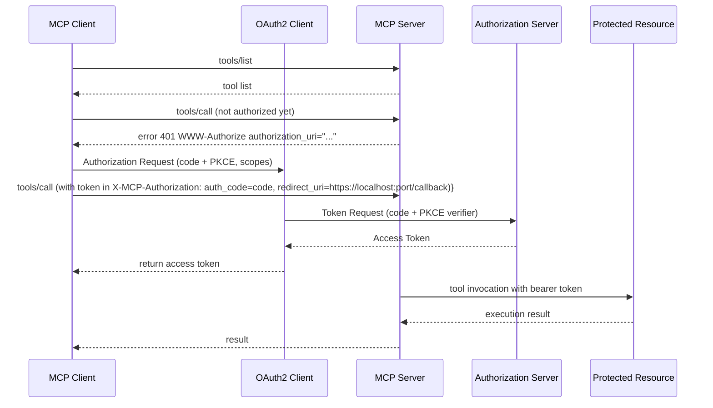
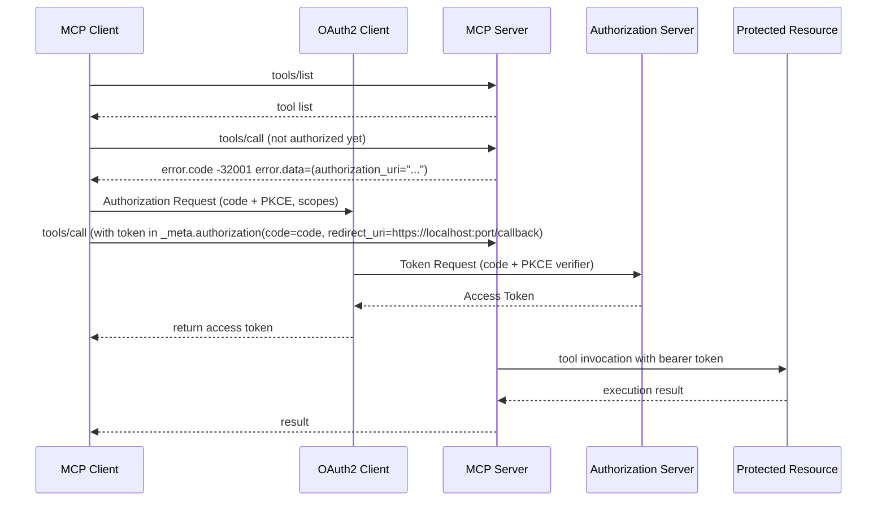

# Fine-Grained Resource Control for Multi-User Authorization

## Motivation

Many MCP clients require per-user credentials to call downstream APIs, and the lack of a standard leads to inconsistent
client behavior and security gaps. This proposal standardizes OAuth-based authorization in MCP.

## Background

Multiple ideas have been discussed in the MCP community about how to handle **authorization** for tools and resources in
multi-user scenarios:

- **Per-Tenant Configuration** via _meta: One proposal (
  Discussion [#193](https://github.com/modelcontextprotocol/modelcontextprotocol/discussions/193) suggested allowing a
  single MCP server instance to serve many end-users by passing a clientId and user-specific clientConfig in each
  request
    - This would reconfigure the server per call (e.g. providing a different API token or target resource for each user)
      instead of requiring separate server instances.
    - This approach treats user credentials or context as part of the call metadata, enabling multi-tenant clients to
      dynamically inject config for each end-user.

- **MCP Server as OAuth 2.0 Resource Server**:
  Issue [#205](https://github.com/modelcontextprotocol/modelcontextprotocol/discussions/205) proposed that MCP servers
  should act as OAuth 2.0 resource servers, using external identity providers for authorization.
    - In this model, the MCP server itself doesn’t issue tokens or maintain session state; the client obtains an access
      token from an OAuth authorization server (via any standard flow) and presents it with requests
    - The MCP server can then rely on standard OAuth mechanisms – for example, returning an HTTP 401 with a
      WWW-Authenticate challenge or providing discovery info – to prompt the client to get proper tokens
    - This design leverages existing enterprise auth infrastructure (increasing adoptability) and keeps MCP servers
      stateless
    - It could also enable the server to perform an OAuth 2.0 Token Exchange (RFC 8693) on the client’s token to act on
      behalf of the user
    - This would allow the MCP server to act as a proxy for the client, using its own token to call downstream APIs on
      behalf of the user, obtaining a delegated token for downstream APIs.
- **On-Behalf-Of (OBO) Token Exchange**: Related to the above, discussion
  #214(https://github.com/modelcontextprotocol/modelcontextprotocol/discussions/214) raised support for OAuth 2.0 Token
  Exchange (RFC 8693) to avoid passing raw user tokens around. The idea is to enable delegation: an agent client might
  present one token to an MCP server, which exchanges it for a new token restricted to the server’s context (preventing
  misuse of the original token). This was motivated by security concerns that simply forwarding user tokens is risky
    - For example, the Cloudflare team illustrated a model where the MCP server issues its own token to the client
      instead of exposing the user’s Google API token, thereby limiting an attacker’s capabilities if the client token
      is compromised
    - This addresses the OWASP-described risk of “Excessive Agency”, by ensuring a stolen token can only invoke the MCP
      server’s constrained tools, not the upstream service broadly
- **Per-Tool OAuth Scopes (Multi-User Auth)**: In discussion
  #234(https://github.com/modelcontextprotocol/modelcontextprotocol/discussions/234), wdawson proposed adding an
  authorization spec to each tool definition to declare what kind of token and scopes it requires
    - The MCP client (e.g. an AI agent) would then acquire an appropriate end-user token (say via OAuth2) and supply it
      at call time in the request metadata
    - This lets one agent serve many users, each providing their own credentials for external services, without the MCP
      server persisting those credentials. The proposal introduced a JSON-RPC error code for authorization failures
      (`-32001` for missing or invalid tokens), analogous to HTTP 401 Unauthorized.
    - The emphasis was on keeping the server stateless and focused on proxying the tool action, while pushing token
      management to the client
    - This approach was seen as meeting the industry “where it is” with OAuth, rather than requiring new auth frameworks

- **Client vs. Server Responsibility Debate**: There is ongoing discussion about the trade-offs of the client-managed
  token approach.
    - Many agree that the MCP server should stay focused on exposing tools and resources without storing user tokens. At
      the same time, concerns were raised about security and complexity for client developers. For instance, if each
      tool integration requires the client to implement a different OAuth flow, it burdens agent developers and could
      discourage use of certain tools
    - It was suggested that MCP needs a mechanism for the server to guide the client through authorization when needed
      for example, by providing an authorization URL or instructions if a token is missing. Others pointed out that
      standard OAuth consent flows already allow users to grant a subset of scopes, and the server could simply enforce
      scope requirements (skipping or failing a tool call if not authorized) without additional protocol changes
    - There was even a proposal that the server could handle the OAuth exchange and then hand the obtained token back to
      the client for storage , combining a smoother user onboarding with client-side token storage thereafter.

  In summary, the community has explored per-tool and per-resource auth scopes, multi-tenant call metadata, client vs
  server auth roles, token exchange, and error handling for auth. Building on those ideas, this proposal aims to
  consolidate a path forward for fine-grained resource control in MCP, aligning with established terminology and
  extending the protocol where needed.

---

## Proposal Summary

## Per-Tool / Resource Auth Metadata

Each tool or resource **declares** its own authorization requirements via a separate policy. The MCP server is responsible for enforcing this policy.

| Field                       | Type     | Purpose                                                                                                                 |
|-----------------------------|----------|-------------------------------------------------------------------------------------------------------------------------|
| `protectedResourceMetadata` | object   | A [RFC 9728]-compliant JSON fragment describing the resource, including its URI and associated `authorization_servers`. |
| `required_scopes`           | string[] | The minimal OAuth scopes required. If empty, only a bearer token is expected.                                           |
| `use_id_token`              | boolean  | If `true`, the system requests an ID token *instead of or in addition to* an access token.                              |
| `client_id`                 | string   | The confidential OAuth 2.0 client identifier registered with the Authorization Server.                                  |

---

### Backend-for-Frontend (BFF) Architecture with Resource-Bound Access Tokens

To enforce strong security boundaries and maintain control over OAuth flows, the MCP architecture adopts a Backend-for-Frontend (BFF) pattern. 
In this model, the MCP Server acts as an intermediary between the MCP Client (typically a browser or desktop application) and downstream protected resources.

#### Key Characteristics

- **MCP Client is Lightweight**  
  The client (frontend) does not directly handle sensitive tokens or secrets. It initiates OAuth flows via URLs provided by the MCP Server, but does not retain or manage access tokens.

- **MCP Server as the Confidential Client**  
  The MCP Server is the registered OAuth 2.0 confidential client. It performs the token exchange, holds client credentials, and manages scopes and lifetimes.

- **Resource-Bound Access Tokens**  
  Each issued access token is explicitly bound to a single resource (audience). This means:
    - The Authorization Server (AS) knows which resource the token is intended for.
    - Tokens cannot be reused across resources, reducing the blast radius of leaks or misuse.
    - Fine-grained policies (per resource) are easier to enforce.

- **Initiation Flow**  
  When the MCP Client requires access:
    1. The MCP Server constructs an `/authorize` URL with the appropriate `client_id`, `scope`, `resource`, and `code_challenge`.
    2. The MCP Client redirects the user-agent to that URL.
    3. On completion, the AS redirects back with an auth code, which the MCP Server exchanges for tokens.
    4. The MCP Server then acts on behalf of the user with the downstream resource.

- **No Token or Secret Exposure to Client**  
  The frontend never sees client secrets, access tokens, or refresh tokens. This maintains a strong separation of concerns and reduces the attack surface.
 
--

### Two Authorization Mediation Modes

The MCP server supports two mediation flows for initiating OAuth authorization when credentials are missing or insufficient:

---

#### 1. **HTTP SSE Enforced Security**

- When a Server-Sent Events (SSE) request arrives **without credentials**, the MCP server responds with:

HTTP/1.1 401 Unauthorized
```http request
WWW-Authenticate: Bearer authorization_uri=".../authorizer?resource=…,scope=…,client_id=…,code_challenge=…,code_challenge_method=…,redirect_uri=…,state=…",
protected_metadata="…/.well-known/oauth-protected-resource"
```

- The client then initiates a front-channel **Authorization Code + PKCE** flow using the provided parameters,and retries the SSE request with:
X-MCP-Authorization: code:<auth-code>, redirect_uri: ... 

#### 2. **JSON-RPC Enforced Security**

- If the `tools/call`, `resource/read` method is invoked **without valid credentials**, the server responds with a structured authorization error:

```json
{
  "jsonrpc": "2.0",
  "id": 42,
  "error": {
    "code": -32001,
    "message": "Unauthorized",
    "data": {
      "authorization_uri": ".../authorizer?resource=…,scope=…,client_id=…,code_challenge=…,code_challenge_method=…,redirect_uri=…,state=…"
    }
  }
}
```
- The client then initiates a front-channel **Authorization Code + PKCE** flow using the provided parameters,and retries the request with:
  _meta.authorization{code=code, redirect_uri=https://localhost:port/callback)}
```json
{
  "jsonrpc": "2.0",
  "id": 42,
  "method": "tools/call",
  "params": {
    "name": "myTool",
    "arguments": {},
    "_meta": {
      "authorization": {
        "code": "xxxx...",
        "redirect_uri": "..."
      }
    }
  }
}
```
  
💡 These two modes are proposed because MCP may operate over multiple transports—including non-HTTP channels like stdio—where traditional HTTP status codes and headers (e.g., 401 Unauthorized, WWW-Authenticate) are not applicable.
In those environments, JSON-RPC error responses serve the same purpose: to deliver authorization metadata and trigger the OAuth flow.
This dual-mode approach ensures consistent security regardless of the transport protocol.

---_

### Token Redemption & Caching (MCP Server Side)

* MCP server redeems the code (PKCE verifier + `client_id`) at the AS.
* Access-tokens are cached per **(resource, scope, client)** triple.
* Refresh or silent-refresh when possible; never expose tokens outside the server boundary.
* MCP server should follow secure storage and logging best practices.

---

## Proposal Details

### Policy Schema Example

```jsonc
{
  "global": {
    "protectedResourceMetadata": {
      "resource": "MCPServer",
      "authorization_servers": [
        "https://auth.acme-cloud.com"
      ]
    },
    "required_scopes": ["scope1"],
    "use_id_token": false,
    "client_id": "myClientId1"
  },
  "tools": [
    {
      "protectedResourceMetadata": {
        "resource": "myTool",
        "authorization_servers": []
      },
      "required_scopes": ["scope1"],
      "client_id": "myClientId2"
    }
  ],
  "resources": [
    {
      "protectedResourceMetadata": {
        "resource": "s3://myBucketX/asset",
        "authorization_servers": []
      },
      "required_scopes": ["read_write"],
      "use_id_token": true
    },
    {
      "protectedResourceMetadata": {
        "resource": "gs://myBucketY/asset",
        "authorization_servers": []
      },
      "required_scopes": ["read"],
      "use_id_token": true,
      "client_id": "myClientId3"
    }
  ]
}
```

## Proposal Details

### Centralized  Authorization Policy bounded to Global MCP, Tools and Resources

Idea: Every tool or resource advertises the auth rule it needs.

| Field                     | Type     | Purpose                                                                                                                                                           |
|---------------------------|----------|-------------------------------------------------------------------------------------------------------------------------------------------------------------------|
| protectedResourceMetadata | object   | **RFC 9728** — JSON object containing the OAuth 2.0 *Protected Resource Metadata* (as served from `/.well-known/oauth-protected-resource/resource=RESOURCE_URI`). |
| requiredScopes            | string[] | The minimal OAuth scopes the caller must present. An empty array means “bearer token is enough; no extra scope checking.”                                         |
| useIdToken                | boolean  | `true` → supply an OpenID Connect ID token instead of / in addition to an OAuth access-token.                                                                     |
| clientId                  | string   | Confidential OAuth 2 client id                                                                                                                                    | 

Authorization rules are defined in a separate configuration schema that maps to tools, resources, or global defaults.

```json
{
  "global": {
    "protectedResourceMetadata": {
      "resource": "MCPServer",
      "authorizationServers": [
        "https://auth.acme-cloud.com"
      ]
    },
    "requiredScopes": [
      "scope1"
    ],
    "useIdToken": false,
    "clientId": "myClientId1"
  },
  "tools": [
    {
      "protectedResourceMetadata": {
        "resource": "myTool",
        "authorizationServers": []
      },
      "requiredScopes": [
        "scope1"
      ],
      "clientId": "myClientId2"
    }
  ],
  "resources": [
    {
      "protectedResourceMetadata": {
        "resource": "s3://myBucketX/asset",
        "authorizationServers": []
      },
      "requiredScopes": [
        "read_write"
      ],
      "useIdToken": true
    },
    {
      "protectedResourceMetadata": {
        "resource": "gs://myBucketY/asset",
        "authorizationServers": []
      },
      "requiredScopes": [
        "read"
      ],
      "useIdToken": true,
      "clientId": "myClientId3"
    }
  ]
}
```


Each entry in this external policy schema corresponds to the Protected Resource Metadata (RFC 9728) and is extended with
two MCP-specific fields:

- `requiredScopes`: the minimal OAuth scopes that the client must present.
- `useIdToken`: a boolean indicating if an OpenID Connect ID token should be used instead of (or in addition to) an
  access token.
- `clientId`: the client ID to use for the OAuth2 authorization server.

This unified representation lets operators configure resource metadata and per-resource authorization requirements in
one place, without modifying individual tool definitions.


### Backend-for-Frontend (BFF) Architecture with Resource-Bound Access Tokens

### Backend-for-Frontend (BFF) Architecture with Resource-Bound Access Tokens

To authorize access to MCP tools and resources, this proposal adopts a **Backend-for-Frontend (BFF)** architecture with **resource-bound access tokens**. This ensures that tokens are only valid for their intended audience and cannot be reused across services.

Clients do not proactively fetch authorization policy. Instead, when calling a tool without prior authorization, the MCP server responds with a `401 Unauthorized` error that includes the necessary **authorization metadata**. The client then uses this metadata to initiate the authorization flow.

Specifically, the MCP client launches an OAuth 2.0 Authorization Code flow with PKCE, using the provided parameters such as `client_id`, `resource`, `code_challenge`, and `state`. 
After user authorization, the client receives an authorization code. The MCP server then redeems the code—along with the code verifier, client credentials, and any required parameters


a)  HTTP SSE Enforced Security — Sequence Diagram

```json
HTTP/1.1 401 Unauthorized
WWW-Authenticate: Bearer authorization_uri="https://example.com/.well-known/oauth-protected-resource", scope="read write", resource="https://api.example.com", client_id="my-oauth2_client_id", code_challenge="xxxx", code_challenge_method="S256"
```



b) JSON-RPC Enforced Security





## Client-Side Implementation

When a tool requires authorization, the MCP client is responsible for handling the initial user-facing portion of the OAuth 2.0 Authorization Code flow using PKCE. 
This includes launching a `redirect_uri` listener, retrieving the `auth_code`, and returning both values to the MCP server.


### Authorization Flow Steps

1. **Start a Local Redirect Listener**  
   The client starts a temporary HTTP server on a **dynamically chosen localhost port** (e.g., `http://127.0.0.1:38545/callback`) to receive the `auth_code` after the user authenticates.

2. **Initiate Browser-Based Authorization Flow**  
   The client opens the browser to the `authorization_uri`, including:
    - `client_id`
    - `code_challenge`
    - `redirect_uri` (pointing to the local listener)
    - `resource`
    - `state`
    - PKCE parameters (e.g. ,`code_challenge`, `code_challenge_method`)

3. **Receive Authorization Code**  
   After the user completes the login/consent flow, the Authorization Server redirects the browser back to the local listener with:

GET /callback?code=...&state=...

4. **Send Code + Redirect URI to MCP Server**  
     The client sends a follow-up request to the MCP server with the received `auth_code` and `redirect_uri`.


### Including `redirect_uri` and `auth_code` via `X-MCP-Authorization`: Rationale and Alternatives

In this proposal, when a client initiates an OAuth 2.0 flow and receives an `auth_code`, it resends the **original payload** (e.g., the SSE or JSON-RPC request) along with an `X-MCP-Authorization` header containing both:

- `code` (the authorization code received from the redirect)
- `redirect_uri` (the local dynamic listener URL used in the flow)

Example: `X-MCP-Authorization: code=xyz, redirect_uri=http://127.0.0.1:38545/callback`


### Why the `redirect_uri` Must Be Sent

When exchanging an authorization code at the `/token` endpoint, the **OAuth 2.0 specification (RFC 6749 §4.1.3)** requires that the `redirect_uri` parameter in the token request **must exactly match** the one used in the initial `/authorize` request. 
This is a critical anti-phishing measure to prevent code injection or misuse.


This becomes particularly important when the redirect URI uses a **dynamic port** (e.g., `http://127.0.0.1:38545/callback`), which may differ on every authorization flow. 
Since the MCP server is responsible for redeeming the code, it must know the exact `redirect_uri` value used by the client.
Thus, the client must include the redirect URI in its response to the MCP server.

---
### Why Use the `X-MCP-Authorization` Header?

Using a custom header has several advantages:

- **Separation of concerns**: Authorization metadata (code, redirect_uri) is isolated from the payload, avoiding pollution of application-level data structures.
- **Avoids misuse of Bearer token semantics**: Since this is an *intermediate* OAuth step, it's cleaner to avoid mislabeling it as a full `Authorization: Bearer ...` token.

---

### Alternative Approaches Considered 

#### 1. **Inline Metadata in Request Body or Payload**

- Example:
  ```json
  {
    "request": { ... },
    "_meta": {
      "authorization": {
        "code": "xyz",
        "redirect_uri": "http://127.0.0.1:38545/callback"
      }
    }
  }


## Security Considerations

* Refresh tokens should be stored securely; MCP Server OAuth2 clients should follow best practices for token rotation
  and expiration.
* Servers MUST NOT log tokens or include them in error messages.
* Servers MAY support token revocation and introspection (RFC 7662) to detect and respond to compromised tokens.

## References

- RFC 6749: OAuth 2.0 Authorization Framework
- RFC 6750: OAuth 2.0 Bearer Token Usage
- RFC 7519: JSON Web Token (JWT)
- RFC 7636: Proof Key for Code Exchange (PKCE)
- RFC 7662: OAuth 2.0 Token Introspection
- RFC 9728: Protected Resource Metadata (OAuth 2.0)
- RFC 8693: OAuth 2.0 Token Exchange
- RFC 8707: Resource Indicators for OAuth 2.0
- RFC 8752: OAuth 2.0 Demonstration of Proof-of-Possession at the Application Layer

### Design Considerations and Trade-offs

Initial proposals favored having clients handle the entire OAuth 2.0 flow and manage token storage. However, as @wdawson
pointed out, this approach introduces security vulnerabilities (the "confused deputy" problem).

The updated design delegates token management to the MCP server, except for initiating the OAuth 2.0 authorization code
flow: the server provides the client with the authorization endpoint, client ID, and PKCE parameters, and the client
returns the authorization code. The MCP server then redeems the code to obtain an access token, caches it, and refreshes
it as needed.

This proposal takes a pragmatic approach by treating the MCP client as an OAuth 2.0 client and the MCP server as an
OAuth 2.0 resource server, leveraging standard flows and existing infrastructure.
In practice, agents acting on behalf of users are already trusted with user data and actions, so they are responsible
for securely initiating the authorization flow. 
